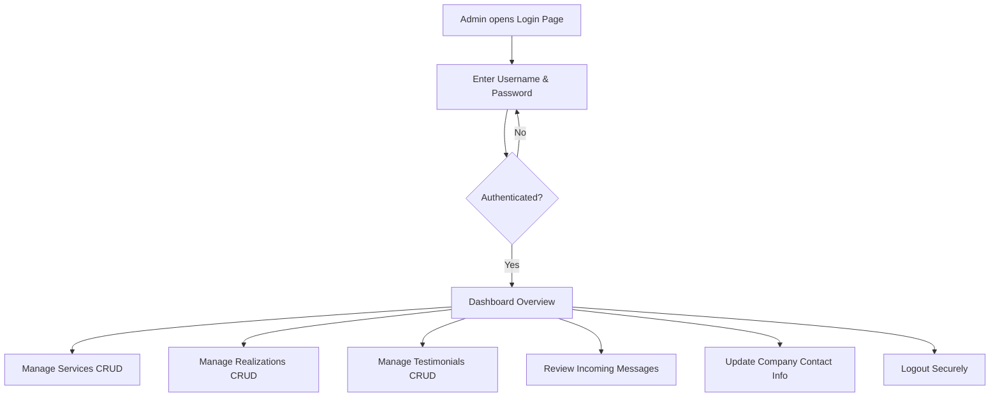

# MD Design - Phase 1.2: Actors (Acteurs)

This document identifies and defines the actors who will interact with the MD Design web application, along with their roles, permissions, and typical user flows.

---

## 1. Visitor (Visiteur)

### Definition:
A Visitor is any anonymous guest who accesses the public Front Office website of MD Design. They are typically prospective local clients (businesses or vehicle owners) in Tangier seeking outdoor advertising, vehicle wrap services, or contact details.

### Privileges & Permissions:
* Read-only access to services and past realizations.
* Ability to filter portfolio projects by service category.
* Ability to read client testimonials.
* Permission to submit the public contact form (which creates database records).
* Ability to click the WhatsApp redirection CTA button to request quotes.

### Typical Visitor Flow:
```mermaid
graph TD
    A[Visitor arrives on Home Page] --> B[Read Company Presentation]
    A --> C[Browse Services]
    A --> D[View Realizations Gallery]
    C --> E[Click "Request Quote via WhatsApp"] --> F[Redirect to WhatsApp with templated text]
    D --> G[Filter realizations by Service category]
    A --> H[Navigate to Contact Page]
    H --> I[Fill & Submit Contact Form] --> J[Message saved in Database]
```

---

## 2. Administrator (Administrateur)

### Definition:
An Administrator is a designated member of the MD Design agency staff who manages the website's dynamic content and customer messages. They access the application through a secure Back Office dashboard.

### Privileges & Permissions:
* Complete Read, Write, Edit, and Delete (CRUD) operations on:
  * **Services:** Create new services, upload dynamic images, modify names, edit descriptions, or toggle active status.
  * **Realizations:** Add past projects, assign them to a service category, upload images, update descriptions, or remove listings.
  * **Testimonials:** Add or delete client reviews and client profile photos.
* **Message Board:** Read client submissions from the contact form and mark messages as read.
* **Settings:** Update global corporate parameters (phone, WhatsApp link, social media links, address, logo, description) which are immediately updated dynamically on the Front Office.

### Typical Administrator Flow:

