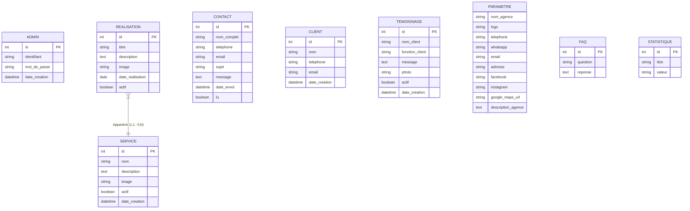

# MD Design - Phase 1.5: Conceptual Data Model (MCD)

This document describes the Conceptual Data Model (Modèle Conceptuel de Données - MCD) for the MD Design application.

---

## 1. MCD Definition
The MCD represents the conceptual structure of the database. It defines the business **Entities**, their **Attributes**, and the **Associations** (relationships) between them, along with their cardinalities, independent of any database engine or software constraints.

---

## 2. Entities & Attributes

### 1. ADMIN
Represents the system administrators.
* **id** (Identifier/Key)
* **identifiant** (admin username)
* **mot_de_passe** (hashed password)
* **date_creation** (timestamp)

### 2. SERVICE
Represents the dynamic advertising services offered by the agency.
* **id** (Identifier/Key)
* **nom** (service name)
* **description** (text details)
* **image** (file path to image)
* **actif** (boolean toggle)
* **date_creation** (timestamp)

### 3. REALISATION
Represents portfolio items demonstrating past client wraps, signs, or covering projects.
* **id** (Identifier/Key)
* **titre** (project name)
* **description** (details)
* **image** (file path to image)
* **date_realisation** (date)
* **actif** (boolean toggle)

### 4. CONTACT
Represents messages sent by visitors through the contact form.
* **id** (Identifier/Key)
* **nom_complet** (visitor name)
* **telephone** (phone number)
* **email** (email address)
* **sujet** (subject line)
* **message** (content body)
* **date_envoi** (timestamp)
* **lu** (boolean status)

### 5. CLIENT
Reserved table for potential future CRM features.
* **id** (Identifier/Key)
* **nom** (client name)
* **telephone** (phone number)
* **email** (email address)
* **date_creation** (timestamp)

### 6. TEMOIGNAGE
Represents client testimonials.
* **id** (Identifier/Key)
* **nom_client** (client name)
* **fonction_client** (job title or company)
* **message** (review content)
* **photo** (file path to client avatar)
* **actif** (boolean toggle)
* **date_creation** (timestamp)

### 7. PARAMETRE
Represents the singleton configuration details for the agency.
* **nom_agence** (name)
* **logo** (file path to logo)
* **telephone** (contact phone)
* **whatsapp** (WhatsApp API phone number)
* **email** (general contact email)
* **adresse** (physical location)
* **facebook** (profile link)
* **instagram** (profile link)
* **google_maps_url** (embedded maps link)
* **description_agence** (company bio)

### 8. FAQ
Represents Frequently Asked Questions.
* **id** (Identifier/Key)
* **question** (FAQ question)
* **reponse** (FAQ response)

### 9. STATISTIQUE
Represents numeric statistics shown on the home page.
* **id** (Identifier/Key)
* **titre** (stat label)
* **valeur** (stat number/string, e.g., "15+")

---

## 3. Associations & Cardinalities

There is one main relational association in this database structure:

### Association: `Appartenir` (Belong)
Connects **REALISATION** and **SERVICE**:
* **REALISATION (1,1) <---> Appartenir <---> (0,N) SERVICE**
* **Cardinality Realisation to Service (1,1):** A specific portfolio realization must belong to exactly one service category.
* **Cardinality Service to Realisation (0,N):** A service category can have zero or many realizations.

Other entities are independent configuration or transaction log entities, requiring no foreign key links.

---

## 4. Mermaid Conceptual ER Diagram

