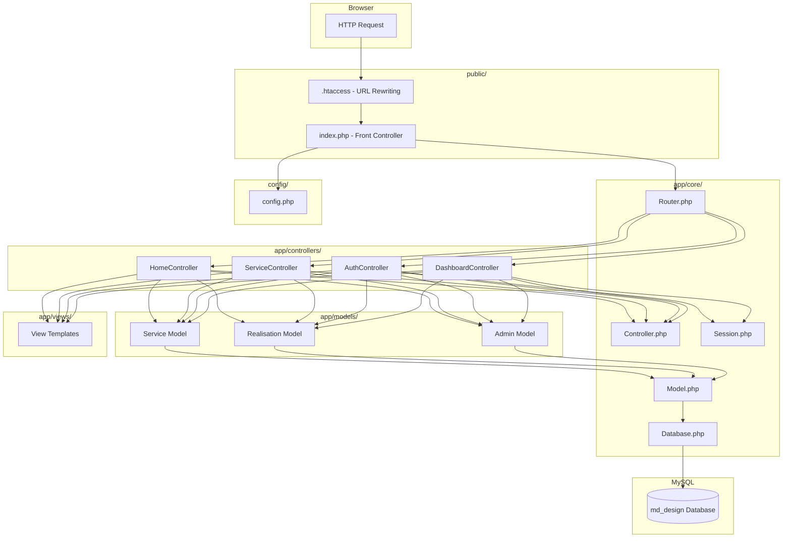

# MD Design - Phase 1.8: MVC Architecture Overview

This document describes the Model-View-Controller (MVC) architecture implemented in the MD Design project and how the request lifecycle flows through the system.

---

## 1. What is MVC?

MVC is a software design pattern that separates an application into three interconnected layers:

* **Model (M):** Handles data logic. Models communicate with the MySQL database via PDO to read, insert, update, or delete records. They know nothing about the user interface.
* **View (V):** Handles presentation. Views are PHP/HTML template files that display data to the user. They receive data from controllers but contain no business logic or SQL queries.
* **Controller (C):** Handles request logic. Controllers receive the user's HTTP request, call the appropriate Model methods to fetch or modify data, and then pass that data to a View for rendering.

---

## 2. Request Lifecycle in MD Design

Here is the complete journey of a single HTTP request through the application:

```
Browser Request (e.g. GET /services)
        │
        ▼
┌──────────────────┐
│  public/index.php │  ← Single entry point (Front Controller)
│  Loads config     │
│  Loads autoloader │
│  Creates Router   │
└────────┬─────────┘
         │
         ▼
┌──────────────────┐
│  app/core/Router  │  ← Matches URL to a Controller@method
│  dispatch()       │
└────────┬─────────┘
         │
         ▼
┌───────────────────────────┐
│  app/controllers/          │  ← Controller receives request
│  ServiceController@index() │
│  Calls Model methods       │
└────────┬──────────────────┘
         │
         ▼
┌──────────────────────────┐
│  app/models/Service.php   │  ← Model queries the database
│  $this->db->all(...)      │
│  Returns data array       │
└────────┬─────────────────┘
         │
         ▼
┌───────────────────────────┐
│  app/views/service/        │  ← View renders HTML with data
│  index.php                 │
│  Uses layouts (header,     │
│  navbar, footer)           │
└────────┬──────────────────┘
         │
         ▼
   HTML Response sent
   back to Browser
```

---

## 3. File-to-Layer Mapping

### Core Layer (`app/core/`)
These files form the skeleton of our custom MVC framework:

| File | Role | Description |
|------|------|-------------|
| `Database.php` | Infrastructure | Singleton PDO connection manager |
| `Router.php` | Routing | Maps URL patterns to controller actions |
| `Controller.php` | Base Controller | Provides `view()` and `redirect()` helpers |
| `Model.php` | Base Model | Provides `all()`, `find()`, and DB access |
| `Session.php` | Security | Manages PHP sessions for authentication |

### Models Layer (`app/models/`)
Each model corresponds to a database table:

| File | Table | Purpose |
|------|-------|---------|
| `Admin.php` | `admin` | Authentication & password verification |
| `Service.php` | `service` | CRUD operations on services |
| `Realisation.php` | `realisation` | CRUD + join with service table |
| `Contact.php` | `contact` | Save inquiries, mark as read |
| `Temoignage.php` | `temoignage` | CRUD for client reviews |
| `Parametre.php` | `parametre` | Read/update company settings |
| `Client.php` | `client` | Reserved for future CRM |

### Controllers Layer (`app/controllers/`)
Each controller handles a group of related routes:

| File | Routes Handled | Actions |
|------|----------------|---------|
| `HomeController.php` | `/`, `/home` | `index()` |
| `ServiceController.php` | `/services`, `/services/detail` | `index()`, `detail()` |
| `RealisationController.php` | `/realisations` | `index()` |
| `ContactController.php` | `/contact` | `index()`, `submit()` |
| `AuthController.php` | `/login`, `/logout` | `login()`, `logout()` |
| `DashboardController.php` | `/admin/dashboard` | `index()` |
| `ParametreController.php` | `/admin/parametres` | `index()`, `update()` |
| `TemoignageController.php` | `/admin/temoignages` | `index()`, `create()`, `edit()`, `delete()` |

### Views Layer (`app/views/`)
Organized by feature module:

| Directory | Contains |
|-----------|----------|
| `views/layouts/` | Shared templates: `header.php`, `navbar.php`, `footer.php`, `admin_header.php`, `admin_sidebar.php` |
| `views/home/` | Public home page template |
| `views/service/` | Service list and detail templates |
| `views/realisation/` | Portfolio gallery template |
| `views/contact/` | Contact form template |
| `views/auth/` | Login form template |
| `views/dashboard/` | Admin dashboard template |
| `views/parametre/` | Settings form template |
| `views/temoignage/` | Testimonial management templates |

### Helpers Layer (`app/helpers/`)

| File | Purpose |
|------|---------|
| `functions.php` | Utility functions (URL generation, asset paths, escaping output) |
| `validator.php` | Input validation helpers (email format, required fields, phone format) |

---

## 4. Front Controller Pattern (public/index.php)

The entire application uses a **single entry point** design:

1. Every HTTP request is redirected to `public/index.php` via `.htaccess` URL rewriting.
2. `index.php` loads the configuration, initializes the session, and creates the Router.
3. The Router reads the URL, finds the matching controller and method, and calls it.
4. This pattern ensures that no PHP file is accessed directly, improving security.

---

## 5. Mermaid Architecture Diagram


