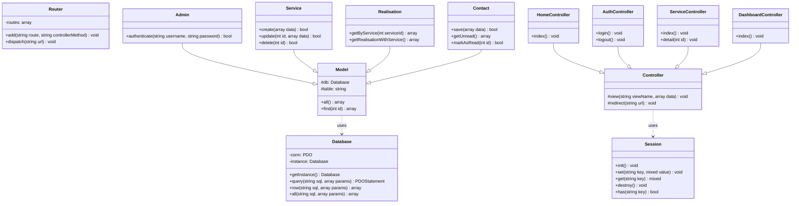

# MD Design - Phase 1.7: UML Class Diagram (UML Classes)

This document maps out the object-oriented structure of the MD Design application, detailing the properties, method signatures, visibilities, and relationships of the PHP classes.

---

## 1. Class Visibility Notation
* **`+` Public:** Accessible from outside the class.
* **`#` Protected:** Accessible only within the class and inheriting classes.
* **`-` Private:** Accessible only inside the declaring class.

---

## 2. UML Classes Definition

### A. Core Base Classes (Framework Core)

#### 1. Class: `Database`
Manages the PDO database connection.
* **Properties:**
  * `-conn: PDO`
  * `-instance: Database` (Singleton reference)
* **Methods:**
  * `+getInstance(): Database`
  * `+query(sql: string, params: array): PDOStatement`
  * `+row(sql: string, params: array): array` (returns single row)
  * `+all(sql: string, params: array): array` (returns table)

#### 2. Class: `Router`
Maps request URLs to Controller actions.
* **Properties:**
  * `-routes: array`
* **Methods:**
  * `+add(route: string, controllerMethod: string): void`
  * `+dispatch(url: string): void`

#### 3. Class: `Controller`
Base controller class that renders Views.
* **Methods:**
  * `#view(viewName: string, data: array): void`
  * `#redirect(url: string): void`

#### 4. Class: `Model`
Base model class providing connection access.
* **Properties:**
  * `#db: Database`
  * `#table: string`
* **Methods:**
  * `+all(): array`
  * `+find(id: int): array`

#### 5. Class: `Session`
Manages PHP session states and security checks.
* **Methods:**
  * `+init(): void`
  * `+set(key: string, value: mixed): void`
  * `+get(key: string): mixed`
  * `+destroy(): void`
  * `+has(key: string): bool`

---

### B. MVC Entity Models (Data Layer)

All model classes inherit from **Model**.

* **`Admin`**: Handles login verifications (`authenticate(user, pass): bool`).
* **`Service`**: Manages CRUD for service records (`create(data)`, `update(id, data)`, `delete(id)`).
* **`Realisation`**: Retrieves portfolio items and categories (`getByService(serviceId)`).
* **`Contact`**: Saves contact inquiries and tracks reading statuses (`save(data)`, `markAsRead(id)`).
* **`Temoignage`**: Retrieves reviews (`getActiveTestimonials()`).
* **`Parametre`**: Manages company settings (`getSettings()`, `updateSettings(data)`).

---

### C. MVC Controllers (Logic Layer)

All controller classes inherit from **Controller**.

* **`HomeController`**: Renders public home.
* **`ServiceController`**: Displays list and detail views.
* **`RealisationController`**: Renders the filterable portfolio.
* **`ContactController`**: Validates and process contact forms.
* **`AuthController`**: Handles login forms, authentication sessions, and logout commands.
* **`DashboardController`**: Renders metrics on the admin dashboard.
* **`ParametreController`**: Processes configuration settings forms.

---

## 3. Mermaid UML Class Diagram

